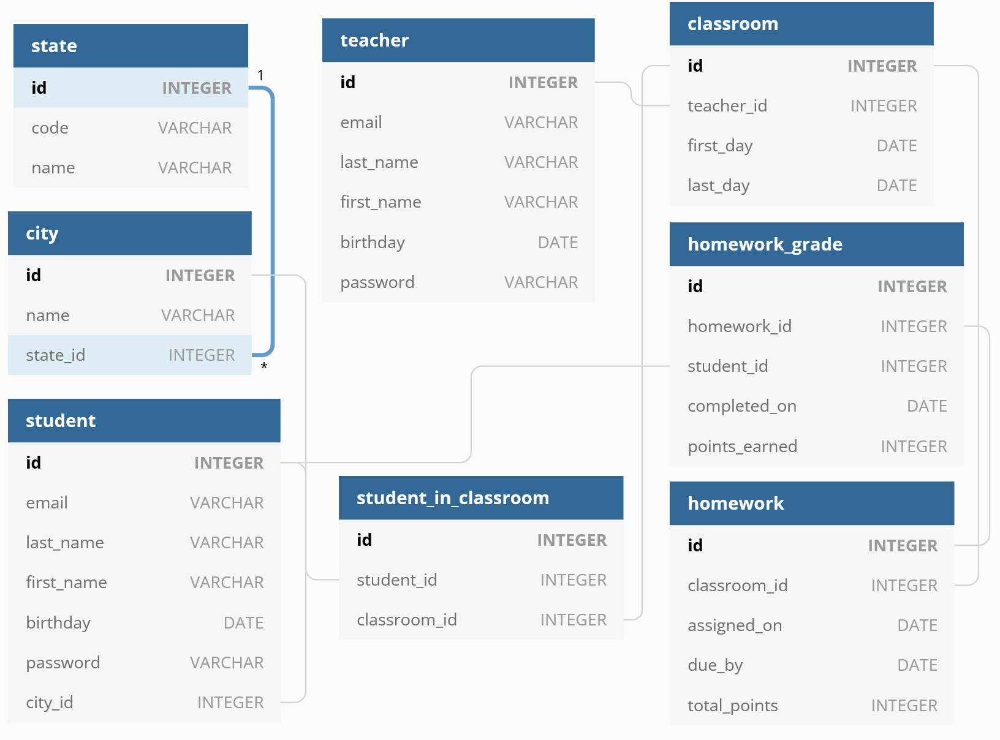

# Demo School Database

## Exercise

Take an hour or two to go through and try to answer as many of the following prompts as best you can. You **do not** have to address them in order, and you **do not** have to answer all of them. If you think you can do all of them in that time period you are welcome to, but if you would like to choose several related ones to perform an analysis of and omit the rest that is also acceptable. Many of these do not have a "correct" answer, so we are primarily looking for:

- The tools you use to perform and compile your analysis
- Your thought process, assumptions, and queries used to draw your conclusions
- Clarity of the presented data
- The ability to extract, transform, and present data in a concise and digestible format

You can present the auxiliary information (toolset, thought process, assumptions, and approach) in whatever way makes sense to you. A screencast, write-up, powerpoint, live recording of attempting to extract the data, these are all acceptable. Each answered prompt should, however, have one or more simple artifacts that support the conclusion drawn (graphs, tables, etc).

If you have any clarifying questions feel free to ask!

### Prompts

Download the database file ([`school.sqlite`](./school.sqlite)) from this repository (or clone this repository if you are familiar with Git, but that is not a requirement of this exercise), and please help us find the following information:

1. Several parents have complained that Glyn Kamil grades too harshly. Does this teacher show a pattern of unfair grading? Why or why not?
2. Are any of our other teachers grading too harshly?
3. Are any of our teachers grading too leniently?
4. We would like a report on our students who are struggling so we can give them extra attention
5. We would also like a report of our highest-achieving students so we can speak to their parents about Advance Placement courses
6. How does the performance of students across different states compare to each other?
7. Which assignments have not been turned in?
8. Is there a correlation between assignments not being turned in and students who have not been doing well in their studies?

Present your findings using whatever technology and methodology you are most comfortable with and best helps you get your analysis across.

### Notes on the data

This is a demonstration database with tables containing student, teacher, class, and homework assignment records. Some non-obvious facts about the data:

- Homework that was turned in late is automatically docked by 10 points and this is already reflected in the `homework_grade.points_earned` totals.
- If a student fails to turn in an assignment it is omitted from the database (because there can be no `homework_grade.completed_on` date) but still counts towards their overall grade.

#### Schema

The schema can be found in [`db-schema.txt`](./db-schema.txt), which is a file that can be loaded into [https://dbdiagram.io/d](https://dbdiagram.io/d). Just copy the contents of the file and overwrite the value in the sidebar on the dbdiagram page. It will generate a graphic that looks like this:



If you are familiar/comfortable with the Python library SQLAlchemy, the file that was used to generate these tables can also be found in [`models.py`](./models.py). The use of SQLAlchemy, Python, or any other specific toolset is not required as part of this exercise; utilize whatever you are most comfortable with.

## SQLite
If you are unfamiliar with SQLite, it is just another SQL database format, but one that is purely file-based and does not require a dedicated server to read and query.

The canonical database for this exercise is held in [`school.sqlite`](./school.sqlite), and you can access it using any of a multitude of tools that are capable of reading sqlite data. Some examples are:

- [`https://inloop.github.io/sqlite-viewer/`](https://inloop.github.io/sqlite-viewer/) - In-browser SQLite database reader. Simple drag and drop interface that lets you do straightforward queries.
- [`https://sqliteonline.com/`](https://sqliteonline.com/) - Also in-browser. More feature-rich but more complicated to use and get started with.
- [`https://sqlitebrowser.org/`](https://sqlitebrowser.org/) - Lightweight Open Source installable Sqlite browser for Windows, MacOS, and Linux.

Or feel free to use any other utilities you're familiar with. Python3 also comes with a baked-in Sqlite3 library.

```python
import sqlite3

con = sqlite3.connect('school.sqlite')
cur = con.cursor()
for row in cur.execute('SELECT * FROM student'):
    print(row)
# This will print all of the student rows from the database. You can run any
# valid Sqlite query in this manner
```
